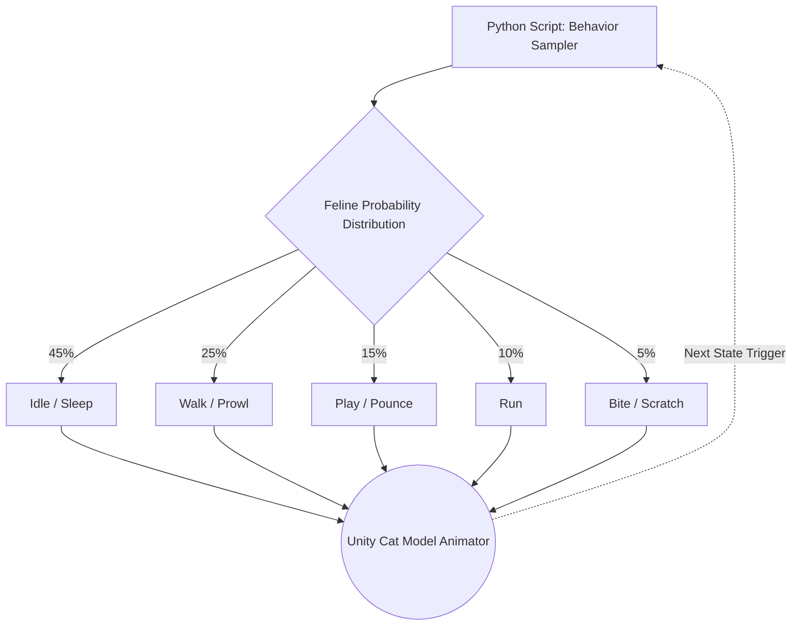

# PetGuard: Robotic Pet Companion & Safety System

## Introduction & Prerequisites
PetGuard is a software-based service that enables consumer robots to actively engage in a pet’s daily life—supporting wellbeing, preventing mishaps, and providing owners with actionable insights without being destructive or intrusive. 

PetGuard is designed to help in three key ways:
1. **Prevent trouble before it happens.**
2. **Observe behavior & flag changes.**
3. **Enrich daily life through play & companionship.**

As a prerequisite for development, a physical [Anki Vector companion robot](https://en.wikipedia.org/wiki/Anki_(company)) was made readily available to the team such that probing tests became possible.

## My Contribution: Simulating Feline Behavior
I was entrusted with building a [Unity](https://en.wikipedia.org/wiki/Unity_(game_engine)) cat model and making it emulate the behavior of a real cat for simulation purposes. While the former assignment was somewhat doable (especially after I found my way around the Unity environment), the latter seemed cumbersome since there are multiple ways to approach it.

During the architecture phase, three distinct methodologies were evaluated:

1. **Manual State Definition (Adopted):** The method that turned out to be both straightforward and achievable within the dictated time constraints was to define a list of basic animal motions from scratch, ensuring that movements ranging from biting and jumping up to running were hardcoded.
2. **Probabilistic Sampling (Explored):** Importing an already defined subset of cat movements and creating a Python script that randomly samples movements from a probability distribution, resembling the movement frequency of an average cat.
3. **Stochastic Modeling (Theoretical):** Creating a [Markovian chain](https://en.wikipedia.org/wiki/Markov_chain) that can do the exact same thing but in a much more randomized, state-dependent manner.

### Visualization of Approach 2 (Probabilistic Sampling)
*The following diagram illustrates the theoretical architecture for the Python-driven probabilistic sampling method we designed during the ideation phase.*

## 📦 Preview 
<video src="https://x.com/ChngShiyi34142/status/2022840828457034199/video/1" controls="controls" width="100%"></video>

